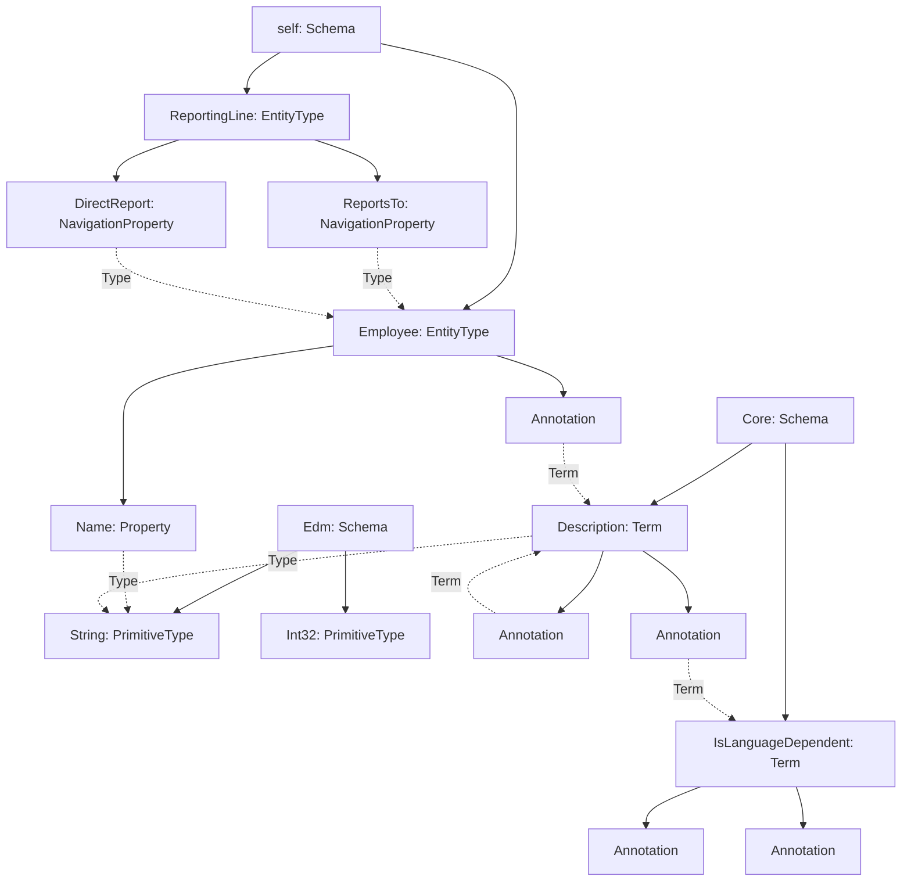

```mermaid
graph
n0[self: Schema]
n1[Employee: EntityType]
n2[Name: Property]
n3[Annotation]
n4[ReportingLine: EntityType]
n5[ReportsTo: NavigationProperty]
n6[DirectReport: NavigationProperty]
n7[Edm: Schema]
n8[String: PrimitiveType]
n9[Int32: PrimitiveType]
n10[Core: Schema]
n11[Description: Term]
n12[Annotation]
n13[Annotation]
n14[IsLanguageDependent: Term]
n15[Annotation]
n16[Annotation]
n0-->n1
n1-->n2
n1-->n3
n0-->n4
n4-->n5
n4-->n6
n7-->n8
n7-->n9
n10-->n11
n11-->n12
n11-->n13
n10-->n14
n14-->n15
n14-->n16
n2-. Type .-> n8
n3-. Term .-> n11
n5-. Type .-> n1
n6-. Type .-> n1
n11-. Type .-> n8
n12-. Term .-> n11
n13-. Term .-> n14
```
