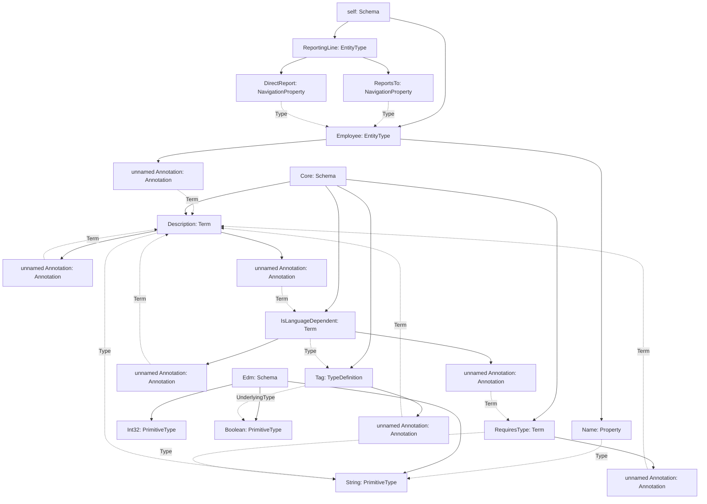

# csdl

```mermaid
graph
n0[self: Schema]
n1[Employee: EntityType]
n2[Name: Property]
n3[unnamed Annotation: Annotation]
n4[ReportingLine: EntityType]
n5[ReportsTo: NavigationProperty]
n6[DirectReport: NavigationProperty]
n7[Edm: Schema]
n8[String: PrimitiveType]
n9[Int32: PrimitiveType]
n10[Boolean: PrimitiveType]
n11[Core: Schema]
n12[Description: Term]
n13[unnamed Annotation: Annotation]
n14[unnamed Annotation: Annotation]
n15[IsLanguageDependent: Term]
n16[unnamed Annotation: Annotation]
n17[unnamed Annotation: Annotation]
n18[Tag: TypeDefinition]
n19[unnamed Annotation: Annotation]
n20[RequiresType: Term]
n21[unnamed Annotation: Annotation]
n0-->n1
n0-->n4
n1-->n2
n1-->n3
n2-. Type .-> n8
n3-. Term .-> n12
n4-->n5
n4-->n6
n5-. Type .-> n1
n6-. Type .-> n1
n7-->n8
n7-->n9
n7-->n10
n11-->n12
n11-->n15
n11-->n18
n11-->n20
n12-->n13
n12-->n14
n12-. Type .-> n8
n13-. Term .-> n12
n14-. Term .-> n15
n15-->n16
n15-->n17
n15-. Type .-> n18
n16-. Term .-> n12
n17-. Term .-> n20
n18-->n19
n18-. UnderlyingType .-> n10
n19-. Term .-> n12
n20-->n21
n20-. Type .-> n8
n21-. Term .-> n12
```
