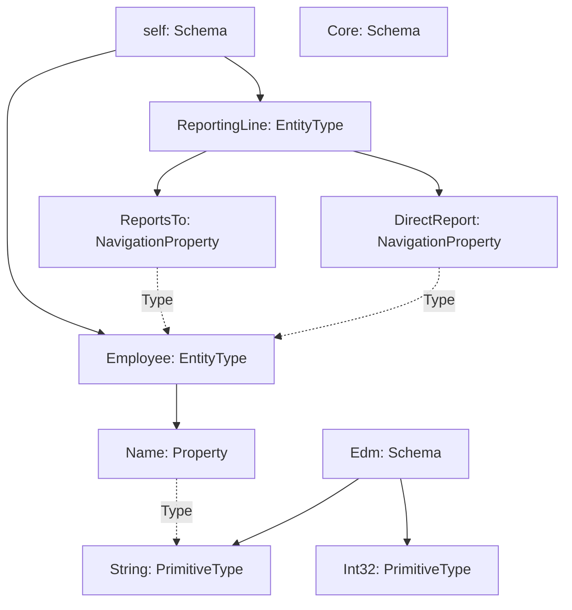

```mermaid
graph
n0[self: Schema]
n1[Employee: EntityType]
n2[Name: Property]
n3[ReportingLine: EntityType]
n4[ReportsTo: NavigationProperty]
n5[DirectReport: NavigationProperty]
n6[Edm: Schema]
n7[String: PrimitiveType]
n8[Int32: PrimitiveType]
n9[Core: Schema]
n0-->n1
n1-->n2
n0-->n3
n3-->n4
n3-->n5
n6-->n7
n6-->n8
n2-. Type .-> n7
n4-. Type .-> n1
n5-. Type .-> n1
```
