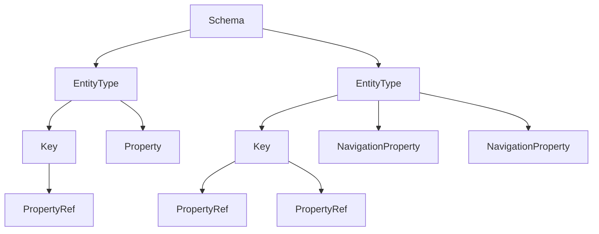

```mermaid
graph
    n0[Schema]
    n1[EntityType]
    n2[Key]
    n3[PropertyRef]
    n4[Property]
    n5[EntityType]
    n6[Key]
    n7[PropertyRef]
    n8[PropertyRef]
    n9[NavigationProperty]
    n10[NavigationProperty]
    n0-->n1
    n1-->n2
    n2-->n3
    n1-->n4
    n0-->n5
    n5-->n6
    n6-->n7
    n6-->n8
    n5-->n9
    n5-->n10
```