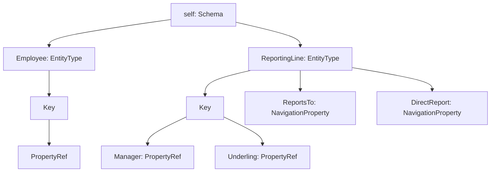

```mermaid
graph
n0[self: Schema]
n1[Employee: EntityType]
n2[Key]
n3[PropertyRef]
n4[ReportingLine: EntityType]
n5[Key]
n6[Manager: PropertyRef]
n7[Underling: PropertyRef]
n8[ReportsTo: NavigationProperty]
n9[DirectReport: NavigationProperty]
n0-->n1
n1-->n2
n2-->n3
n0-->n4
n4-->n5
n5-->n6
n5-->n7
n4-->n8
n4-->n9
```
