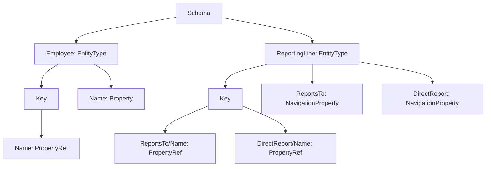

```mermaid
graph
n0[Schema]
n1[Employee: EntityType]
n2[Key]
n3[Name: PropertyRef]
n4[Name: Property]
n5[ReportingLine: EntityType]
n6[Key]
n7[ReportsTo/Name: PropertyRef]
n8[DirectReport/Name: PropertyRef]
n9[ReportsTo: NavigationProperty]
n10[DirectReport: NavigationProperty]
n0-->n1
n1-->n2
n2-->n3
n1-->n4
n0-->n5
n5-->n6
n6-->n7
n6-->n8
n5-->n9
n5-->n10
```
