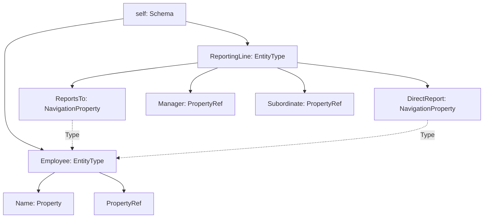

```mermaid
graph
n0[self: Schema]
n1[Employee: EntityType]
n2[Name: Property]
n3[PropertyRef]
n4[ReportingLine: EntityType]
n5[ReportsTo: NavigationProperty]
n6[DirectReport: NavigationProperty]
n7[Manager: PropertyRef]
n8[Subordinate: PropertyRef]
n0-->n1
n1-->n2
n1-->n3
n0-->n4
n4-->n5
n4-->n6
n4-->n7
n4-->n8
n5-. Type .-> n1
n6-. Type .-> n1
```
