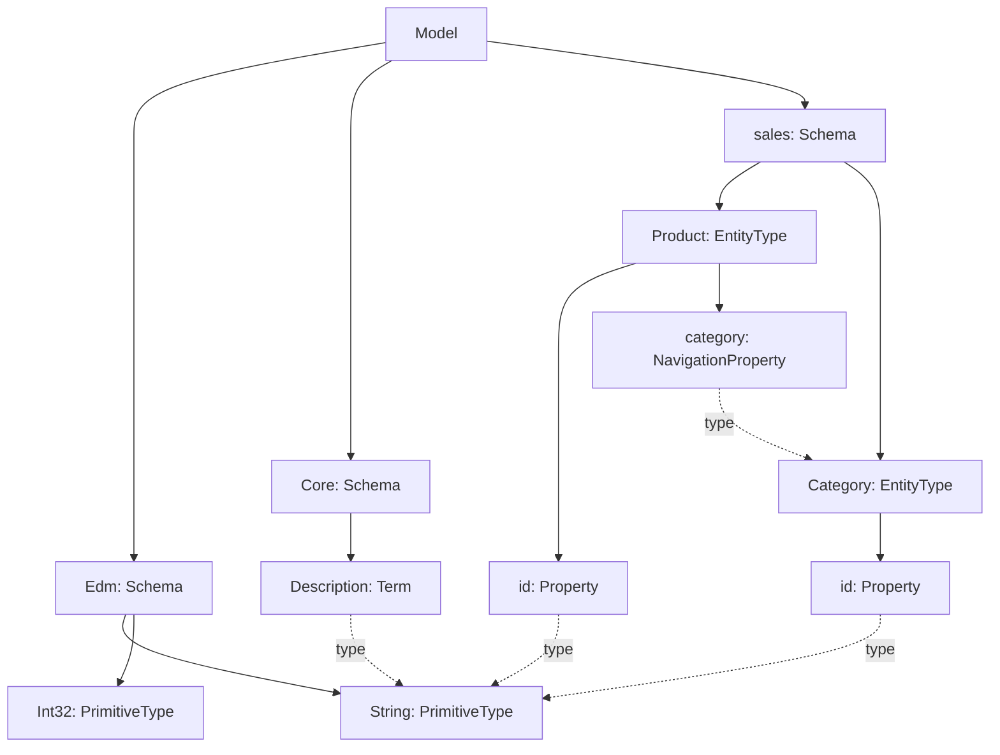

```mermaid
graph
0[Model]
1[Edm: Schema]
2[Core: Schema]
3[sales: Schema]
4[String: PrimitiveType]
5[Int32: PrimitiveType]
6[Description: Term]
7[Product: EntityType]
8[Category: EntityType]
9[id: Property]
10[category: NavigationProperty]
11[id: Property]
0-->1
0-->2
0-->3
1-->4
1-->5
2-->6
3-->7
3-->8
6-.type.->4
7-->9
7-->10
8-->11
9-.type.->4
10-.type.->8
11-.type.->4
```
