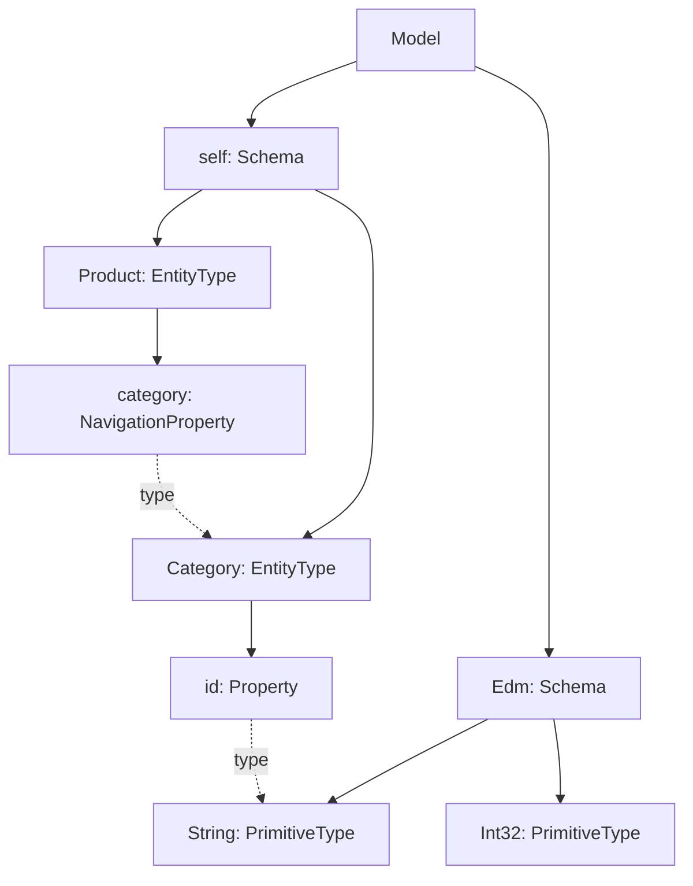

```mermaid
graph
0[Model]
1[Edm: Schema]
2[self: Schema]
3[String: PrimitiveType]
4[Int32: PrimitiveType]
5[Product: EntityType]
6[Category: EntityType]
7[category: NavigationProperty]
8[id: Property]
0-->1
0-->2
1-->3
1-->4
2-->5
2-->6
5-->7
6-->8
7-.type.->6
8-.type.->3
```
